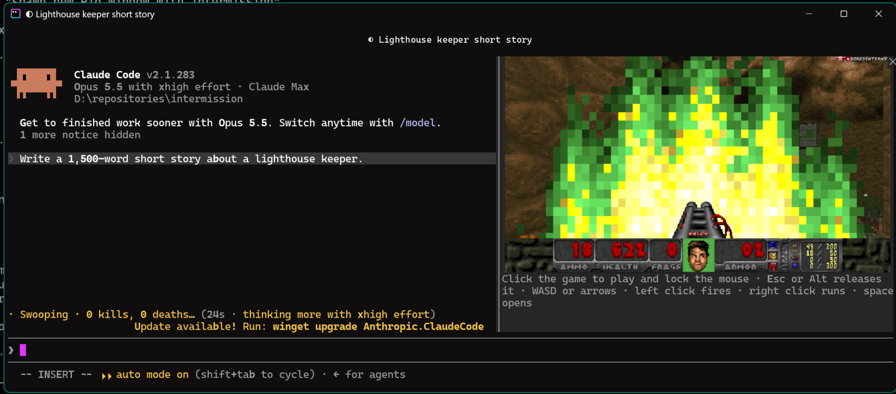

# intermission

A Claude Code plugin that drops you into Doom deathmatch while Claude works, and hands you back when it's done.

[](LICENSE)
[](https://github.com/jarrodwatts/intermission/stargazers)




When Claude has been working for two seconds, a pane opens beside the
transcript and you drop into a free-for-all on a shared server with everyone
else who is waiting on Claude. When Claude finishes there's a three-second
countdown and you're handed back. If Claude needs you, say for a permission
prompt, you're handed back at once and dropped in again after you answer.

It's [Odamex](https://odamex.net) with [Freedoom](https://freedoom.github.io)'s
maps, with monsters left in so the server is never empty.

## Install

1. Install the plugin:

   ```
   /plugin install intermission --marketplace jarrodwatts/intermission
   ```

2. Turn it on:

   ```
   /intermission
   ```

   The first time, it downloads the game, about 20 MB.

To turn it off again, run `/intermission off`.

## Requirements

- macOS 15 or later, on Apple silicon or Intel, in
  [Ghostty](https://ghostty.org) or [kitty](https://sw.kovidgoyal.net/kitty/),
  the terminals that can show the game's pixels
- or Windows 10 or 11 on x64, in [Rio](https://rioterm.com), set up as
  below, with the
  [Microsoft Visual C++ Redistributable](https://learn.microsoft.com/cpp/windows/latest-supported-vc-redist)
- Claude Code 2.1.287 or later

### On Windows

Rio is the one terminal on Windows that can show the game's pixels. Set it up
once, before installing intermission:

1. Install Rio. Through winget it brings the Visual C++ Redistributable the
   game needs too:

   ```powershell
   winget install -e --id raphamorim.rio
   ```

   If you install Rio some other way, add the Redistributable with
   `winget install Microsoft.VCRedist.2015+.x64`.

2. Give Rio ConPTY 1.22 or newer, which it needs to pass pictures through, as
   [Rio's guide](https://rioterm.com/docs/install/windows) describes. In
   PowerShell run as administrator, copy `conpty.dll` and `OpenConsole.exe`
   from Microsoft's
   [ConPTY package](https://www.nuget.org/packages/Microsoft.Windows.Console.ConPTY)
   next to `rio.exe`:

   ```powershell
   curl.exe -L -o "$env:TEMP\conpty.zip" https://www.nuget.org/api/v2/package/Microsoft.Windows.Console.ConPTY
   Expand-Archive "$env:TEMP\conpty.zip" "$env:TEMP\conpty" -Force
   Copy-Item "$env:TEMP\conpty\runtimes\win-x64\native\conpty.dll", "$env:TEMP\conpty\build\native\runtimes\x64\OpenConsole.exe" "C:\Program Files\Rio"
   ```

   Both files must be there: with `conpty.dll` alone, Rio falls back to the
   console host built into Windows, which strips the pictures out.

3. Claude Code sends pictures only to terminals it recognizes, and Rio isn't
   one yet. Tell it to in Rio alone, at the top of
   `%USERPROFILE%\AppData\Local\rio\config.toml`; set everywhere, other
   terminals would show stray characters in place of pictures:

   ```toml
   env-vars = ["CLAUDE_CODE_FORCE_TERMINAL_IMAGES=1"]
   ```

4. Open a new Rio window, start `claude`, and install intermission as above.

If `/intermission` doesn't appear once it's installed, your Claude Code may
not load mods yet; add `"CLAUDE_CODE_ENABLE_FUNCTION_HOOKS=1"` to the same
`env-vars` list.

## Controls

Click the game to play. The click also locks the mouse for turning; Esc or ⌘
releases it. On Windows, Esc or Alt releases it, and the cursor stays in
sight while locked.

| | |
| :- | :- |
| Move | WASD or the arrow keys |
| Turn | the mouse, once locked |
| Fire | left click |
| Run forward | hold right click |
| Open doors | space |
| Weapons | 1 to 7 |

If your terminal is too narrow for the pane to open by itself, a line above the
prompt offers it instead: press 1.

## What it connects to

The game connects over UDP to the intermission server at `157.245.140.115`,
under a random name such as `QueuedMarine42`. Nothing about your session,
project or Claude's work is sent. Between rounds it stays connected as a silent
spectator, and disconnects after five minutes away.

## How it works

The mod runs Odamex without a window. Each frame goes into shared memory, or on
Windows a temporary file, which the terminal paints into the pane, and the pane
passes keys and clicks back.
Terminals report key presses but not releases, so a key counts as held until
its auto-repeat stops. The changes to Odamex are in
[`engine/odamex.patch`](engine/odamex.patch), applied to the commit in
[`engine/odamex-commit`](engine/odamex-commit).

The server is stock Odamex; [`deploy.sh`](deploy.sh) builds and runs it on a
droplet.

## Licenses

The mod is MIT, as in [`LICENSE`](LICENSE). Odamex is GPL-2.0, and so are the
changes to it in `engine/`. Freedoom is BSD-3-Clause.
